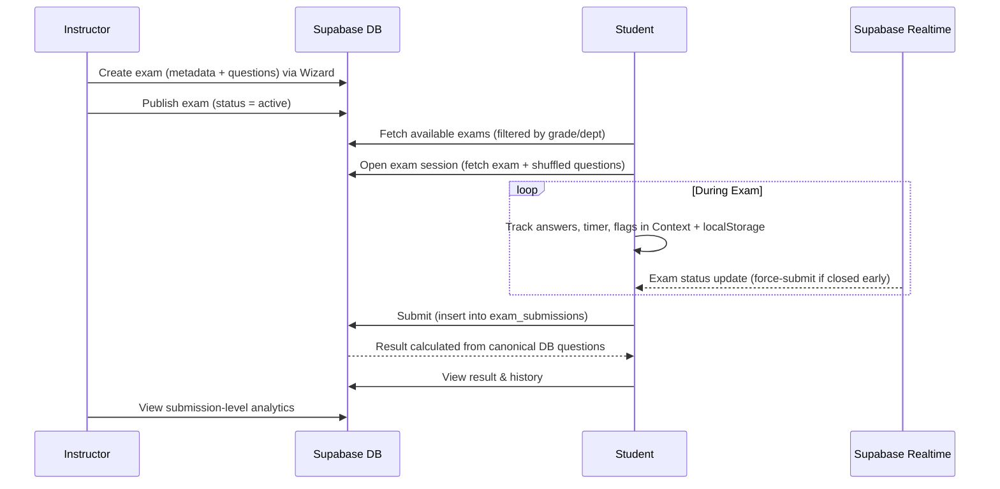

<div align="center">

# 📝 Exam.io

### A full-stack online examination platform with role-based access, real-time anti-cheat, and a 3-step exam wizard.

[](https://react.dev)
[](https://vite.dev)
[](https://supabase.com)
[](https://tailwindcss.com)
[](https://exam-platform-7r4y.vercel.app/)

### 🚀 [**View Live Demo →**](https://exam-platform-7r4y.vercel.app/)

</div>

---

## 📋 Table of Contents

- [Overview](#overview)
- [Features](#features)
- [Tech Stack](#tech-stack)
- [Project Structure](#project-structure)
- [Architecture & Data Flow](#architecture--data-flow)
- [Database Schema](#database-schema)
- [Role System & Routing](#role-system--routing)
- [Key Modules](#key-modules)
- [Performance: Code Splitting & Lazy Loading](#performance-code-splitting--lazy-loading)
- [Getting Started](#getting-started)
- [Environment Variables](#environment-variables)
- [Deployment](#deployment)
- [Scripts](#scripts)

---

## Overview

**Exam.io** is a production-ready online examination platform built with React 19 and Supabase. It supports three distinct user roles — **Student**, **Instructor**, and **Admin** — each with a dedicated dashboard and feature set.

Students take timed, anti-cheat-protected exams that are targeted to their grade and department. Instructors build exams through a guided 3-step wizard and track submission-level performance. Admins oversee all users and platform-wide activity from a dedicated control panel.

---

## Features

### 🎓 Student
| Feature | Details |
|---|---|
| **Available Exams** | Filtered by the student's `grade` and `department` profile |
| **Exam Session** | Full-screen timed exam with question navigation and flagging |
| **Anti-Cheat Engine** | Tab-switch detection, focus-loss tracking, dev-tools heuristics, blocked shortcuts, right-click/copy prevention, navigation blocking, and resize/split-screen heuristics |
| **Auto-submit** | Triggers on timer expiry (`time_up`) or after 3 violations (`cheat`) |
| **Results** | Detailed score breakdown with per-question answer review |
| **Exam History** | Full list of all past submissions with scores and dates |
| **Profile** | Grade/department profile; required for exam eligibility |
| **Session Persistence** | Timer state and answers survive page refreshes via `localStorage` |

### 📚 Instructor
| Feature | Details |
|---|---|
| **3-Step Exam Wizard** | Step 1 — metadata & schedule, Step 2 — questions builder, Step 3 — review & publish |
| **Exam Management** | Create, edit, delete, and change status of exams |
| **Question Bank** | Reusable question library with subject and difficulty metadata |
| **Student Analytics** | Aggregate performance view of enrolled students |
| **Exam History** | Per-exam submission history with detailed result review |
| **Profile** | Instructor profile page |

### 🛡️ Admin
| Feature | Details |
|---|---|
| **Dashboard** | Platform-wide KPIs: total users, active exams, submissions, performance trends |
| **User Management** | View students and instructors; promote accounts and delete users via secure server-side RPC |
| **Exam Oversight** | Browse all exams across all instructors |
| **Reports** | Platform activity reports and analytics |

### 🔐 Authentication
- Email/password registration and login
- Google OAuth
- Email verification flow
- Password reset via email link
- Role auto-detected on login and mapped to the correct dashboard

---

## Tech Stack

| Layer | Technology |
|---|---|
| **Framework** | React 19 |
| **Bundler** | Vite 8 |
| **Routing** | React Router DOM v7 |
| **Backend / DB** | Supabase (PostgreSQL, Auth, Realtime) |
| **Data Fetching** | TanStack Query (React Query v5) |
| **Styling** | Tailwind CSS v4 + CSS custom properties (design tokens) |
| **UI Components** | shadcn/ui, Radix UI primitives |
| **Forms** | React Hook Form |
| **Charts** | Recharts |
| **Animations** | Framer Motion, tw-animate-css |
| **3D / Hero** | React Three Fiber + Drei (landing page) |
| **Date Handling** | date-fns |
| **Notifications** | React Toastify |
| **Icons** | Lucide React, React Icons |
| **Typography** | Geist Variable Font (`@fontsource-variable/geist`) |
| **Deployment** | Vercel |

---

## Project Structure

```
exam_platform/
├── public/                        # Static assets (favicon, OG image)
├── docs/
│   └── system-overview.md         # LLM-optimized technical reference
├── src/
│   ├── App.jsx                    # Route tree (all pages lazy-loaded)
│   ├── main.jsx                   # React DOM entry point
│   ├── index.css                  # Global styles + Tailwind directives
│   │
│   ├── pages/
│   │   ├── HomePage.jsx           # Public landing/home page
│   │   ├── NotFound.jsx           # 404 page
│   │   └── tokens.css             # CSS design token overrides
│   │
│   ├── layouts/
│   │   ├── AdminLayout.jsx        # Admin shell (sidebar + navbar)
│   │   ├── InstructorLayout.jsx   # Instructor shell
│   │   └── StudentLayout.jsx      # Student shell
│   │
│   ├── components/                # Shared / reusable UI components
│   │   ├── Button.jsx
│   │   ├── GenericTable.jsx
│   │   ├── LineChart.jsx
│   │   ├── PieChart.jsx
│   │   ├── Modal.jsx
│   │   ├── Sidebar.jsx
│   │   ├── Navbar.jsx
│   │   ├── PageLoader.jsx         # Suspense fallback (lazy loading)
│   │   ├── ProtectedRoute.jsx     # Redirects unauthenticated users
│   │   ├── RoleRoute.jsx          # Redirects users to correct role dashboard
│   │   ├── ErrorBoundary.jsx      # Top-level error boundary
│   │   ├── StatsCards.jsx
│   │   ├── Profile.jsx
│   │   ├── ResultPage.jsx
│   │   ├── QuestionCard.jsx
│   │   └── ...
│   │
│   ├── features/
│   │   ├── auth/
│   │   │   ├── components/        # LoginForm, RegisterForm, EmailVerification, ResetPassword
│   │   │   ├── context/           # Auth session context
│   │   │   ├── hooks/             # useUser, useLogin, useRegister, useLogout …
│   │   │   ├── services/          # authApi.js (Supabase auth calls)
│   │   │   └── utils/
│   │   │
│   │   ├── student/
│   │   │   ├── available-exams/   # Exam listing filtered by student profile
│   │   │   ├── dashboard/         # Student stats & recent activity
│   │   │   ├── exam-history/      # Past submissions table
│   │   │   ├── exam-session/      # ← Core exam runtime
│   │   │   │   ├── ExamSessionPage.jsx
│   │   │   │   ├── components/    # Timer, QuestionMap, NavigationButtons, ExamHeader …
│   │   │   │   ├── context/       # ExamSessionContext (answers, timer, flags)
│   │   │   │   ├── hooks/         # useExamSession, useAntiCheat, useSubmitExam
│   │   │   │   └── services/      # examSessionApi.js
│   │   │   ├── profile/           # StudentProfilePage + CompleteProfilePage
│   │   │   └── results/           # StudentResultPage (per-submission breakdown)
│   │   │
│   │   ├── instructor/
│   │   │   ├── dashboard/         # Instructor KPI cards & charts
│   │   │   ├── exam-history/      # Per-exam submission history
│   │   │   ├── exam-management/   # Exams table with CRUD actions
│   │   │   ├── exam-wizard/       # 3-step exam creation/edit wizard
│   │   │   │   ├── ExamWizardPage.jsx
│   │   │   │   ├── components/    # Step1, Step2, Step3, ProgressIndicator
│   │   │   │   ├── context/       # WizardContext (wizard state machine)
│   │   │   │   └── hooks/         # useCreateExam, useUpdateExam, usePublishExam
│   │   │   ├── profile/           # InstructorProfilePage
│   │   │   ├── question-bank/     # Reusable question library
│   │   │   ├── results/           # InstructorResultPage (per-submission detail)
│   │   │   └── students/          # Student analytics view
│   │   │
│   │   └── admin/
│   │       ├── dashboard/         # AdminDashboardPage (platform KPIs)
│   │       ├── exam-oversight/    # ExamOversightPage
│   │       ├── reports/           # ReportsPage
│   │       └── user-management/   # UserManagementPage (promote / delete users)
│   │
│   ├── hooks/                     # Global shared hooks
│   │   ├── useExams.js
│   │   ├── useExamFilters.js
│   │   ├── useRecentExams.js
│   │   ├── useCheckSubmissions.js
│   │   └── useUpdateUser.js
│   │
│   ├── services/                  # Shared Supabase API layer
│   │   ├── supabase.js            # Supabase client (reads from .env)
│   │   ├── examApi.js             # Exam CRUD operations
│   │   └── userApi.js             # User profile operations
│   │
│   ├── lib/                       # Utility helpers (cn, formatDate …)
│   └── Utils/                     # Misc utilities
│
├── vite.config.js                 # Vite config with manualChunks
├── vercel.json                    # SPA rewrite rule for Vercel
├── tailwind.config.js
└── package.json
```

---

## Architecture & Data Flow

### Exam Lifecycle



### Question Randomisation (Anti-Cheat)
Questions are shuffled using the **Fisher-Yates algorithm** when a student opens an exam session, ensuring every student sees a different question order.

### Anti-Cheat System
The `useAntiCheat` hook monitors for:
- Tab switches / window blur
- Developer tools detection
- Blocked keyboard shortcuts (F12, Ctrl+Shift+I/J/C, Ctrl+U)
- Right-click and text-selection prevention
- Browser back/forward navigation blocking
- Screen resize / split-screen heuristics

After **3 violations** the exam is auto-submitted with `reason = "cheat"`.

---

## Database Schema

```
auth.users          ← Supabase managed
      │
      ├── student_profiles    (grade, department, full_name, avatar_url)
      ├── instructor_profiles (full_name, avatar_url)
      │
      └── exams               (title, description, duration, start/end_date,
           │                    target_grade, target_dept, status, instructor_id)
           │
           ├── questions       (text, options[], correct_answer, points, exam_id)
           │
           └── exam_submissions (score, time_taken, reason, submitted_at,
                                  user_id, exam_id, answers[])

Views:
  exam_results_view   → joins submissions + exams + profiles + computed percentage
  students_view       → per-student aggregate performance for instructor analytics
```

---

## Role System & Routing

| Path | Role | Guard |
|---|---|---|
| `/` | Public | — |
| `/login`, `/register` | Public | — |
| `/email-verification`, `/reset-password` | Public | — |
| `/home` | Public | — |
| `/complete-profile` | Authenticated | `ProtectedRoute` |
| `/instructor/*` | Instructor | `ProtectedRoute` + `RoleRoute` |
| `/student/*` | Student | `ProtectedRoute` + `RoleRoute` |
| `/admin/*` | Admin | `ProtectedRoute` + `RoleRoute` |

**`ProtectedRoute`** — redirects to `/login` if no active session.

**`RoleRoute`** — redirects users to their correct dashboard if they try to access another role's area. For students, it also redirects to `/complete-profile` if `grade` or `department` is missing.

---

## Key Modules

### `ExamSessionContext`
`src/features/student/exam-session/context/ExamSessionContext.jsx`

The single source of truth during a live exam:
- Stores `currentQ`, `userAnswers`, `flagged`, `timerSec`
- Persists to `localStorage` — survives page refreshes
- Initialises countdown from exam `end_date` + `duration`
- Subscribes to Supabase Realtime on the `exams` table — force-submits if the instructor closes the exam early
- Exposes `submitExam(reason)` where `reason` is `"manual"`, `"time_up"`, or `"cheat"`

### `ExamWizardContext`
`src/features/instructor/exam-wizard/context/`

State machine driving the 3-step creation/edit flow:
- Step 1 — Basic info (title, description, schedule, target grade/dept, duration)
- Step 2 — Questions builder (add/edit/delete MCQ questions)
- Step 3 — Review & publish

Supports both **create** mode and **edit** mode (pre-populated from DB via `examId` URL param).

### Timer
- Implemented with recursive `setTimeout` (avoids `setInterval` drift)
- Auto-submits when `timerSec` reaches `0`
- State persisted in `localStorage` for refresh recovery

---

## Performance: Code Splitting & Lazy Loading

Every page-level component is loaded with `React.lazy()` so Vite emits a dedicated JS chunk per route. Chunks are only downloaded when the user navigates to that route.

```js
// Example from App.jsx
const ExamWizardPage = lazy(() => import("./features/instructor/exam-wizard/ExamWizardPage"));
const ExamSessionPage = lazy(() => import("./features/student/exam-session/ExamSessionPage"));
```

A single `<Suspense fallback={<PageLoader />}>` wraps the `RouterProvider`. While a chunk is downloading, the animated `PageLoader` spinner is shown.

### Vendor Chunk Splitting (vite.config.js)
Heavy dependencies are manually split into long-cached vendor bundles:

| Chunk | Contents | Size (gzip) |
|---|---|---|
| `vendor-react` | react, react-dom, react-router, scheduler | ~87 kB |
| `vendor-charts` | recharts, d3 | ~109 kB |
| `vendor-supabase` | @supabase/* | ~48 kB |
| `vendor-query` | @tanstack/react-query | ~11 kB |
| `[PageName].js` | One chunk per route page | 0.1 – 24 kB |

> Vendor chunks are cached independently in the browser. Updating your app code does **not** bust the Supabase or charts cache.

---

## Getting Started

### Prerequisites
- Node.js ≥ 18
- A [Supabase](https://supabase.com) project

### Installation

```bash
# Clone the repository
git clone https://github.com/your-username/exam_platform.git
cd exam_platform

# Install dependencies
npm install

# Add environment variables (see next section)
cp .env.example .env

# Start the dev server
npm run dev
```

The app will be available at `http://localhost:5173`.

---

## Environment Variables

Create a `.env` file in the project root:

```env
VITE_SUPABASE_URL=https://your-project-id.supabase.co
VITE_SUPABASE_KEY=your-supabase-anon-public-key
```

> ⚠️ Never commit your `.env` file. It is already listed in `.gitignore`.  
> For production (Vercel), add these as **Environment Variables** in the Vercel project settings.

---

## Deployment

🌐 **Live URL:** [https://exam-platform-7r4y.vercel.app/](https://exam-platform-7r4y.vercel.app/)

The project is configured for **Vercel** with a SPA rewrite rule so client-side routes work correctly on direct URL access or refresh:

```json
// vercel.json
{
  "rewrites": [
    { "source": "/(.*)", "destination": "/index.html" }
  ]
}
```

### Deploy your own
1. Fork this repo and push to GitHub
2. Import the repo in [Vercel](https://vercel.com)
3. Set `VITE_SUPABASE_URL` and `VITE_SUPABASE_KEY` in Vercel → Project Settings → Environment Variables
4. Vercel auto-builds and deploys on every push to `main`

---

## Scripts

| Command | Description |
|---|---|
| `npm run dev` | Start Vite dev server with HMR |
| `npm run build` | Production build with code splitting |
| `npm run preview` | Preview the production build locally |
| `npm run lint` | Run ESLint across the codebase |

---

<div align="center">

Made with ❤️ using React + Supabase

[🌐 Live Demo](https://exam-platform-7r4y.vercel.app/) · [⬆️ Back to Top](#-examio)

</div>
